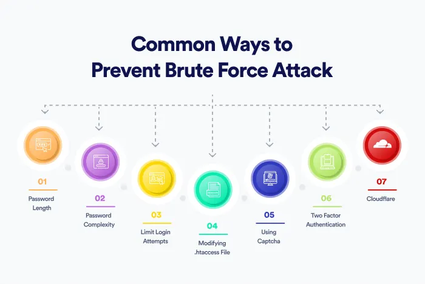

# Bruteforce

Bruteforce is an trial and error method used to decode encrypted data such as passwords, or somethimes the bruteforce is also checking the possible comibination until the valid one is found.

Sometimes even the 2FA can be bypassed if there is logical issue in the code. If the code for the multifactor authentication is short it can bruteforced and we want to check the token for the MFA is time-based, expire on the time, or can check multiple time that could make us to figure out that it is weak or not

## Types of Bruteforce

1. **Simple Bruteforce:** It is trying every possible combinations such as aa, aaaa, aaaaa

2. **Dictionary Attack:** Uses the predefined list of password or words such as rockyou.txt

3. **Hybrid Attack:** Combines dictionary with brute force (example: password1, password123)

4. **Credential Stuffing:** Tries username-password pairs leaked from previous breaches

5. **Reverse Brute Force**: Fixes a common password (example 123456) and tries many usernames

6. **Rule-based Attack**: Applies custom rules to mutate dictionary words (admin → Adm1n!)

## Prevention

1. Account Lockout: Temporarily lock after 3-5 failed attempts usually checks by the IP address so, we should make it proper
2. Captcha: Block bots using a way of puzzle like problem and it makes the bots out of the application
3. Rate Limiting: Slow down multiple login attempts
4. 2FA/MFA: Adds another layer (OTP, SMS, Authenticator app)
5. Strong Password Policy: Minimum length, special chars, etc.
6. IP Blacklisting: Block repeated attempts from IPs
7. WAF (Web App Firewall): Can detect brute-force patterns and prevent it from bruteforce
8. Logging & Monitoring: Alert on login anomalies

## Uses

Often used to find the username and password for an application, if there any logical issue in the code

## Tools

1. Hydra: Fast login cracker (SSH, FTP, HTTP, SMB, etc.)
2. Burp Suite: Repeater + Intruder for HTTP brute force
3. John the Ripper	Offline brute-force on password hashes
4. Hashcat	GPU-based brute-force on password hashes
5. Medusa	Fast network login cracker
6. Ncrack	SSH, RDP, and other services
