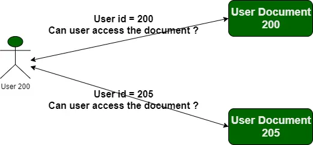
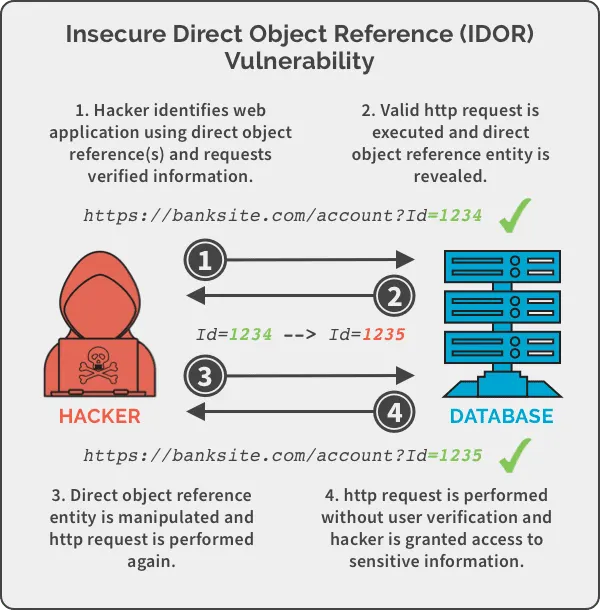

# Insecure Direct Object Reference (IDOR):

IDOR occurs when an application provides the direct access to the objects (files,accounts,or database entry) that have been provided by the user supplied input without proper authentication checks

It may leads the attacker to manipulate the user input to access the files, data or funtionality that the attacker don't have

Usually in all application have profile view by an ID and we can change the id to get the information about other user.

Example:
        https://site_url/user/profile?user_id=102 to https://site_url/user/profile?user_id=103
But it is not vulnerable because many application use this to show only publically available data

If this profile show any data that has sensitive contents like Personally Identifiable Information (PII), bank account so then it show hidden using the authorisation checks

## Real-World Examples
1. User Account Access:

GET /account/4567
If we are user 1234 and can just change the number to access 4567's data, that’s IDOR.

2. File Download:

https://site_url/download?file=invoice123.pdf
Changing it to invoice124.pdf it may lead to download the other invoice records

3. Reset Password for Another User:

POST /reset-password
Body: { "user": "john" }
If you change "john" to "admin" and reset the admin’s password.

These are the most common vulnerabilities in the IDOR

## Mitigation

1. Configure the apps or application to perform whitelist validation on the inputs
2. Replace direct reference in app UPLs with indirect ones
3. Avoid exposing sensitive IDs in URLss
4. Enforces the authentication checks

## Most Vulnerable case

By using the IDOR we can include the server configurations files like /etc/passwd and much more

## Example writeups based on the IDOR

1. [lab-insecure-direct-object-references](https://github.com/minato500/portswigger-writeups/tree/main/lab-insecure-direct-object-references)
2. [lab-user-id-controlled-by-request-parameter](https://github.com/minato500/portswigger-writeups/tree/main/lab-user-id-controlled-by-request-parameter)
